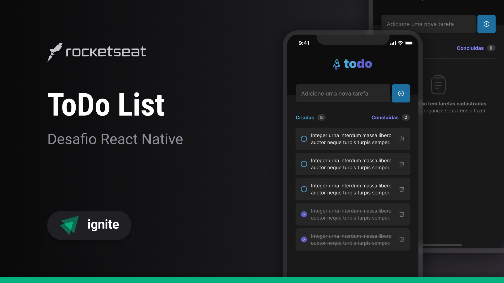

  

  <a href="#-tecnologias">Tecnologias</a>&nbsp;&nbsp;&nbsp;|&nbsp;&nbsp;&nbsp;
  <a href="#memo-licença">Licença</a>

## 🚀 Tecnologias

- TypeScript
- React Native
- Expo

## 🎨 Layout:

Figma: https://www.figma.com/file/hTYfzeBtXq2vEf6KInm9I2/ToDo-List-%E2%80%A2-Desafio-React-Native-(Copy)-(Copy)?type=design&node-id=3603%3A3533&mode=design&t=is2rS3xYEM7MMfh2-1

## :memo: Licença

Esse projeto está sob a licença MIT. Veja o arquivo [LICENSE](LICENSE) para mais detalhes.

---

Feito com ♥ by joaoD3V
